# Análise de dados de abrigo de animais 

O objetivo do projeto, pauta aplicar os conhecimentos de ciência de dados em uma base de dados com tamanho pequeno médio, utilizando a ferramenta Orange, que pode ser acessada pelo conjunto de pacotes Anaconda.

A partir de uma base de dados disponível, utilizando a ferramenta Orange, devemos realizar uma análise exploratória dos dados, submetê-los aos tratamentos necessários e aplicar modelos de machine learning, resgatando os resultados dos modelos aplicados comparando as diversas abordagens de como os dados podem ser tratados.

 
Foram utilizados dados de um abrigo de animais de Austin (EUA), o mesmo possui predominantemente dados categóricos, consequentemente foram utilizados modelos de aprendizados que suportassem entradas e saídas categóricas, como Naive Bayes, Regressão Logística e Random Forest. Os resultados foram satisfatórios frente aos atributos utilizados e notou-se melhora na acurácia dos modelos na medida que os dados foram tratados.

<section>
<h2>Coleta do conjunto de dados</h2>
Os dados utilizados foram coletados a partir da plataforma Kaggle. Eles se referem a dados de saída dos animais do abrigo de Austin (Austin Animal Center) , localizado nos Estados Unidos.

O dataset pode ser acessado pelo link: <a>https://www.kaggle.com/datasets/aaronschlegel/austin-animal-center-shelter-outcomes-and</a>

O mesmo se encontra desatualizado tendo sua última atualização datada há 7 anos atrás, possuindo 147 upvotes e 7741 downloads. Cabe ressaltar que o site do abrigo de Austin disponibiliza uma API para resgate dos dados mais recentes, além de disponibilizá-los em formato CSV. Porém para a proposta deste trabalho, um conjunto de dados pequenos e mais direcionados cumpriam o propósito, sendo os disponibilizados pelo Kaggle mais fáceis de serem carregados a ferramenta Orange.

Além do recorte inicial de data, utilizamos o dataset com as saídas apenas de gatos do abrigo (aac_shelter_cat_outcome_eng.csv), com isso poderiamos realizar uma análise e predição mais direcionada para uma amostra populacional específica.

O conjunto de dados conta com 37 colunas: age_upon_outcome, animal_id, animal_type, breed, color, date_of_birth, datetime, monthyear, name, outcome_subtype, outcome_type, sex_upon_outcome, count, sex, Spay/Neuter, Periods,  Period Range, outcome_age_(days), outcome_age_(years), Cat/Kitten (outcome), sex_age_outcome, age_group, dob_year, dob_month, dob_monthyear, outcome_month, outcome_year, outcome_weekday, outcome_hour, breed1, breed2, cfa_breed, domestic_breed, coat_pattern, color1, color2, coat. 

    <figure name="coleta">
        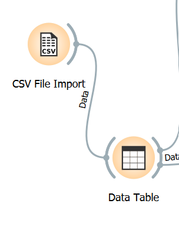
        <figcaption>Figura 1: Widgets para carregamento dos dados.</figcaption>
    </figure>

Foram utilizados os widgets ([Figura 1](#coleta)) CSV file import para importação dos dados e estes foram visualizados utilizando o widget Data Table ([Figura 2](#coleta2)).

    <figure name="coleta2">
        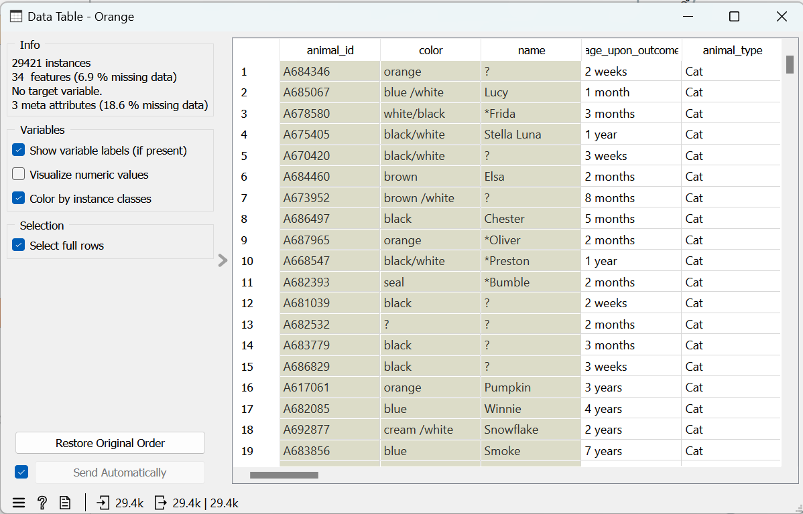
        <figcaption>Figura 2: Visualização inicial dos dados</figcaption>
    </figure>

Como informado pelo Widget Data table, o dataset possui 29421 registros, 37 colunas, sendo 3 delas de meta atributo e 34 de atributos, possuindo 6,9% de dados faltantes.

Mais sobre as colunas e o que cada uma representa será discutido na próxima seção de tratamento dos dados [Seção 2](#tratamento).

</section>

<section name="tratamento">
<h2>Limpeza e preparação dos Dados</h2>
Numa análise exploratória inicial podemos perceber que a base de dados contém muitas variávels. Ao analisar inicialmente, nota-se que muitas delas possuem valores repetidos, porém com um outro formato, enquanto outras quase não possuem dados preenchidos.   

 
Vamos repassar o significado de cada coluna, para verificar quais colunas podem ser utilizadas de alvo e de atributo.

As colunas de meta-dados são:
- animal_id: Id único do animal no abrigo
- name: Nome do animal
- color: Cor do animal, concatenando as diferentes pelagens

As demais colunas são:
- age_upon_outcome: Idade do animal no momento de saída do abrigo, campo de texto sem unidade definida
- animal_type: Tipo do animal analisado, para esta base de dados terá um único valor, pois há apenas gatos
- breed: Raça do gato
- date_of_birth: Data de nascimento do animal
- datetime: Data da saída do animal
- monthyer: Possui os mesmos valore de datetime
- outcome_type: Tipo da saída do animal do abrigo
- outcome_subtype: Sub-tipo de saída do animal
- sex_upon_outcome: Estado reprodutivo do animal ao sair do abrigo
- count: Coluna sem descrição, com apenas valores 1
- sex: Sexo do animal
- Spay/Neuter: Estado de castração do animal
- Periods: Sem descrição formal, assume-se que é a quantidade de cios que o animal possuiu
- Period Range: Sem descrição formal, provavelmente é o período médio de cio do animal
- outcome_age(days): Tempo para saída do animal em dias
- outcome_age(years): Tempo para saída do animal em anos
- Cat/Kitten(outcome): Se animal classificado como gato adulto ou filhote
- age_group: Sem descrição formal, intervalos de idade em que o animal se encaixa
- dob_year: Sem descrição formal
- dob_month: Sem descrição formal
- dob_monthyear: Sem descrição formal
- outcome_month: Mês da saída
- outcome_year: Ano da saída
- outcome_weekday: Dia da semana da saída
- outcome_hour: Hora de saída
- breed1: Mesmos dados de raça da coluna breed
- breed2: Possui 100% dos valores como nulo
- cfa_breed: Raça possui certificação/pedigree
- domestic_breed: Se é uma raça doméstica
- coat_pattern: Tipo de padrão de pelagem
- color1: Tipo de cor primária, semelhante a coluna color, porém possui apenas a cor predominante
- color2: Tipo da cor secundária, em conjunto com a coluna color1 gera a coluna color, 65% dos valores nulos
- coat: Possui os mesmos valores que color1

Os dados apresentam uma grande necessidade de limpeza, em boa parte das colunas que podem ser utilizadas. Temos que o melhor candidato para uma coluna alvo visando realizar determinada predição ou estudo de análise seja a coluna `outcome_type` que significa o tipo de saída do animal do abrigo. Com ela podemos predizer de acordo com as características do animal, qual será o destino dele, se será adotado, transferido ou no pior dos casos eutanasiado.
 

As medidas de limpeza tomadas foram:
- Descarte de colunas sem especificação definida.
- Descarte de todas as colunas de tempo e data referente a saída do animal.
- Utilização de apenas uma coluna para a idade do animal no momento de saída, foi utilizada a coluna `outcome_age(years)`.
- Descarte das colunas com muitos dados faltantes como `breed2` e `color2`
- Descarte das colunas referentes aos períodos de cio.
- Descarte da coluna de nascimento e nome do animal.

Ao final temos as colunas utilizadas para criação do modelo:
`breed, sex_upon_outcome, sex, Spay Neuter, outcome_age(years), Cat/Kitten (outcome), sex_age_outcome, breed1, cfa_breed, domestic_breed, coat_pattern, color1, coat`. 

Temos que as colunas selecionadas trazem informações, principalmente referente a pelagem, sexo e idade do animal.

Após a seleção inicial, verificamos as problemáticas de cada coluna selecionada. Verificamos havia diversos valores nulos na coluna `coat_pattern`. Porém a informação de nulidade também agrega informação ao animal, ou seja podemos classificar o padrão de pelagem como outro ou não definido. Para sanar isto, foi utilizado o widget Impute, com as configurações presentes na [figura 3](#impute). Para os demais dados, foi utilizado o método padrão de popular dados faltantes com a Média/Moda, apenas para a coluna `coat_pattern` atribuímos a um novo valor com a configuração `As a distinct value` onde os valores nulos foram substituídos por `N/A`, possível visualizar o resultado na [figura 4](#impute_table)

    <figure name="impute">
        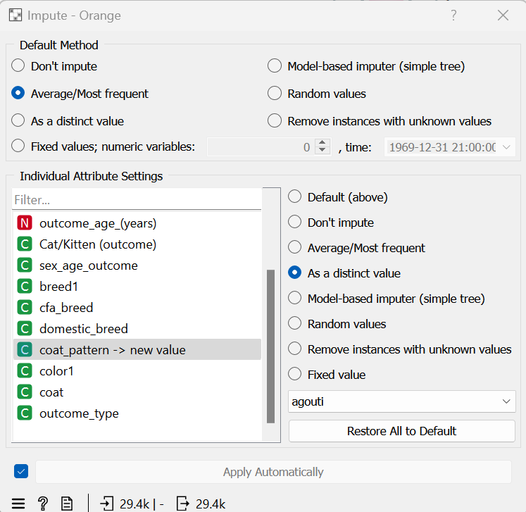
        <figcaption>Figura 3: Configurações Impute</figcaption>
    </figure>

    <figure name="impute_table">
        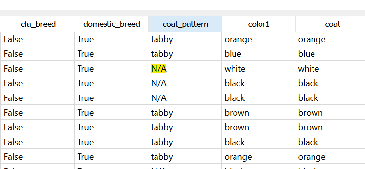
        <figcaption>Figura 4: Dados nulos substituídos</figcaption>
    </figure>

Em seguida devemos tratar o formato das variáveis, como temos uma saída categórica e das variáveis selecionadas, todas são categóricas, exceto a idade de saída `outcome_age(years)`, seria prudente apenas converter a variável de idade numérica para valores categóricos. Foi realizada a discretização dos valores com o widget Preprocess. As configurações utilizadas podem ser visualizadas na [figura 5](#preprocess)

    <figure name="preprocess">
        
        <figcaption>Figura 5: Configurações para discretização</figcaption>
    </figure>

Por último, foi identificado utilizando o widget Pivot que os valores de coloração apresentavam diferentes escritas para um mesmo tipo de valor. ou seja `black` também estava escrito como `black `,  em que este segundo há um espaço em branco ao final da string. Para realizar o tratamento dessas strings, foi utilizado o framework Edit Domain, em que os valores podem ser alterados manualmente, as configurações podem ser vistas na [figura 6](#edit_domain).

    <figure name="edit_domain">
        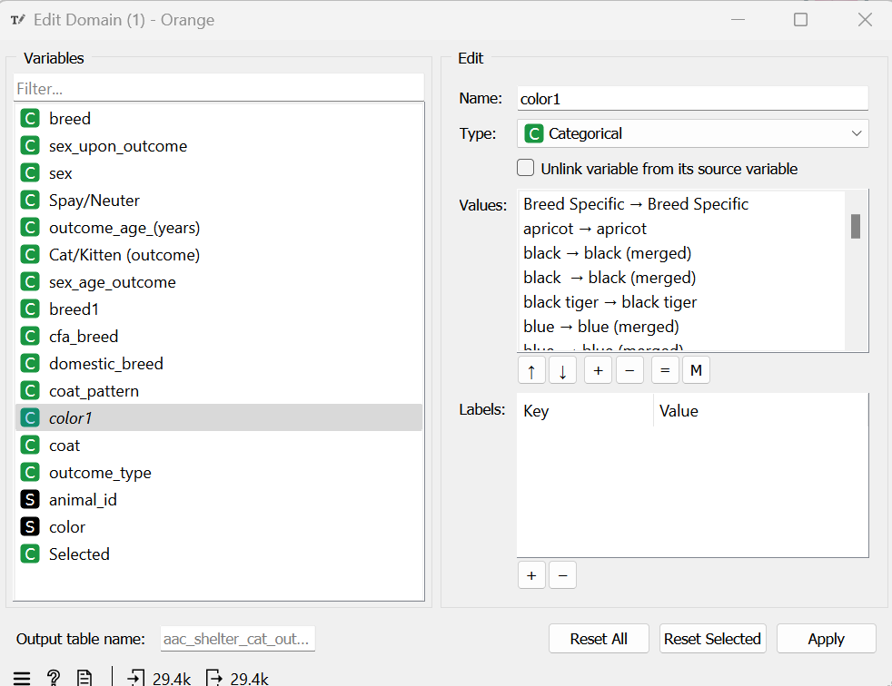
        <figcaption>Figura 6: Edição de valores com diferentes escritas</figcaption>
    </figure>

</section>

<section>
<h2>Análise exploratória dos dados</h2>
Em seguida realizamos a análise exploratória dos dados. Temos predominantemente variáveis categóricas, ou seja, seria difícil aplicar gráficos como de dispersão, sendo o mais aplicável, gráficos de barra ou distribuição. Foi utilizado o framework Distributions, com ele é possível verificar graficamente como as variáveis se relacionam com a saída.

 

Percebemos que a cor de maior predominância entre os animais do abrigo, são os gatos de cor preta, em seguida os de coloração marrom. Por haver muitas classes nas variáveis, encontramos dificuldades na visualização do eixo x. ([Figura 7](#grafico_cor))

    <figure name="grafico_cor">
        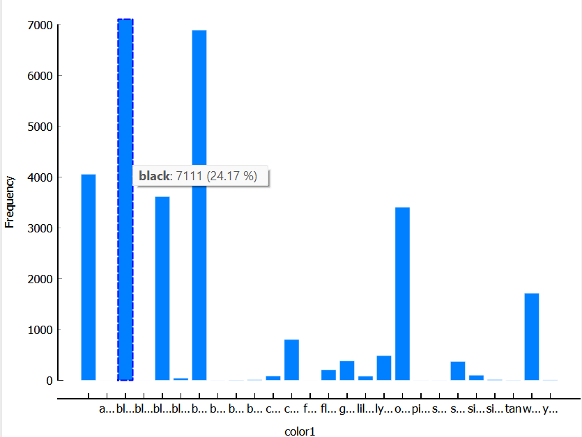
        <figcaption>Figura 7: Gráfico de coloração</figcaption>
    </figure>

Referente as datas de saída dos animais em ano ([figura 8](#grafico_outcome)) temos a maior porcentagem centrada no intervalo de 0,130 (46 dias) a 0,205 (75 dias). Gatos mais jovens tem maior frequência nos dados analisados, isso pode ser visualizado com melhor exatidão antes da etapa de discretização.

    <figure name="grafico_outcome">
        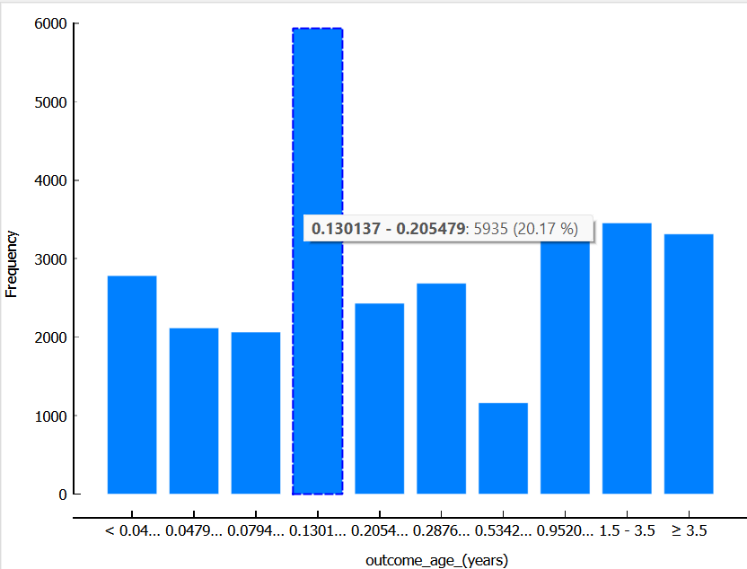
        <figcaption>Figura 8: Histograma com o tempo de saída em anos</figcaption>
    </figure>

As saídas possuem 2 classes com maior predominância, caracterizando um desbalanceamento nas demais classificações, isso pode influenciar no resultado das predições e modelos aplicados. As classes de maior predominância são, Adoption e Transfer, o gráfico referente pode ser visualizado na [figura 9](#grafico_type).

    <figure name="grafico_type">
        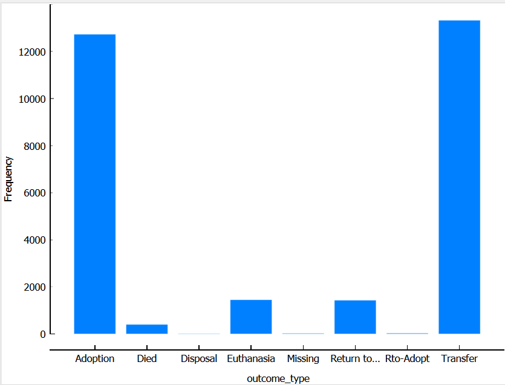
        <figcaption>Figura 9: Gráfico com tipos de saída</figcaption>
    </figure>

</section>

<section>
<h2>Mineração dos Dados</h2>

Foram aplicados alguns algoritmos possível para dados categóricos com saídas categóricas, sendo eles: Naive Bayes, Logistic Regression, Random Forest e Gradiente Boosting. A aplicação de Árvores de Decisão não se tornou possível pois o Orange não permite que sejam aplicadas variáveis com mais de 16 classes diferentes.

O algoritmo com melhor desempenho foi o de regressão logística (Logistic Regression) com AUC de 0.881, mais informações acerca das acurácias obtidas serão discutidas na próxima seção, avaliação dos resultado.

Aplicado ao modelo previamente citado, utilizamos o widget de Predictions para verificar se foram realizadas predições condizentes com o esperado e como as saídas estavam se comportando.

    <figure name="logistic_outcome">
        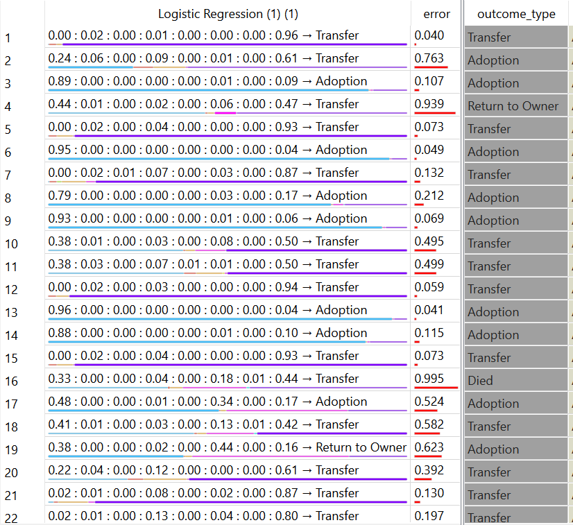
        <figcaption>Figura 10: Predições realizadas pelo algorimto de regressão logística</figcaption>
    </figure>

Na [figura 10](#logistic_outcome) temos exemplos de predições realizadas, realizando uma análise superficional neste pedaço de amostrado coletado, percebe-se que o algoritmo te dificuldade de predizer casos além dos predominantes, como Adoption ou Transfer, tal problema levante a necessidade de desbalancear os dados, ou seja, prover dados com quantidades semelhantes de animais com outros tipos de saída.

As associações obtidas pelo widget Frequent Itemsets e Association não foram de fácil interpretação, e não proveram informações acerca dos tipos de saída, porém serviram como uma visão geral das porcentagens dos tipos de dados. Podemos visualizar o resultado do widget na [figura 11](#association)

    <figure name="association">
        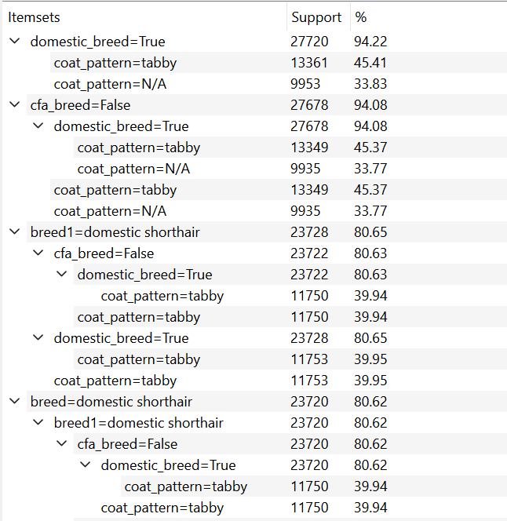
        <figcaption>Figura 11: Regras de associação</figcaption>
    </figure>

Temos que as informações e valores predominantes são de atributos com pouca variedade de classificações, geralmente Sim/Não. Não ficou claro se as regras de associação utilizam da coluna target para sua saída, uma vez que não houve nenhuma associação que remetesse a `outcome_type`. 

</section>

<section>
<h2>Avaliação dos Resultados</h2>

Inicialmente foi utilizado o algoritmo Naive Bayes para verificar como o tratamento dos dados influenciavam no refinamento da acurácia do modelo e no AUC obtido. Submetemos o Naive Bayes a diferentes formatos dos dados, (1) sem nenhum tratamento, (2) colunas selecionadas e valores nulos sanados, (3) adicional 2 com junção de classes de texto semelhantes mas escritas diferentes, (4) adicional ao 2 com discretização dos valores numéricos, (5) todos os processamentos anteriores realizados.
12

<table style="text-align: center">
  <thead>
    <tr>
        <th>Tipo de Pré-processamento</th>
      <th>AUC</th>
      <th>Precision</th>
      <th>Recall</th>
    </tr>
  </thead>
  <tbody>
    <tr>
        <td>(1)</td>
      <td>0.854</td>
      <td>0.742</td>
      <td>0.640</td>
    </tr>
    <tr>
     <td>(2)</td>
      <td>0.854</td>
      <td>0.743</td>
      <td>0.638</td>
    </tr>
    <tr>
     <td>(3)</td>
      <td>0.854</td>
      <td>0.743</td>
      <td>0.640</td>
    </tr>
     <tr>
     <td>(4)</td>
      <td>0.863</td>
      <td>0.753</td>
      <td>0.640</td>
    </tr>
    <tr>
     <td>(5)</td>
      <td>0.864</td>
      <td>0.753</td>
      <td>0.641</td>
    </tr>
  </tbody>
</table>

Como resultado, visualizamos que realizar os pré-processamentos trouxe uma melhoria no resultado do modelo, não foram mudanças expressivas nos valores, porém corroboramos a necessidade do tratamento de dados inicial. Deste ponto agora podemos comparar diferentes modelos para verificar qual melhor se aplica aos dados utilizados. Utilizamos: Naive Bayes, Logistic Regression, Random Forest e Gradiente Boosting, podemos visualizar o resultado dos diferentes modelos na [figura 12](#results)

    <figure name="results">
        
        <figcaption>Figura 12: Resultados de modelos aos dados tratados e processados.</figcaption>
    </figure>

Temos que o modelo de Logistic Regression e o Gradient Boosting tiveram resultados semelhantes, sendo o de Logistic Regression 5 vezes mais rápido.

<h2>Conclusão</h2>

Temos que o algoritmo de regressão logística obteve o melhor resultado na predição de saídas dos animais do abrigo com AUC de 0.881. Melhores insights e refinamento do modelo podem ser obtidos ao sanar o desbalanceamento das diferentes classes de saída.
A maior porcentagem de gatos no abrigo são os que possuem características mais propensas para gatos de rua, como pelagem malhada, coloração preta ou marrom e não possuem raça definida.

O fluxo inteiro pode ser visualizado na figura 13

    <figure name="flow">
        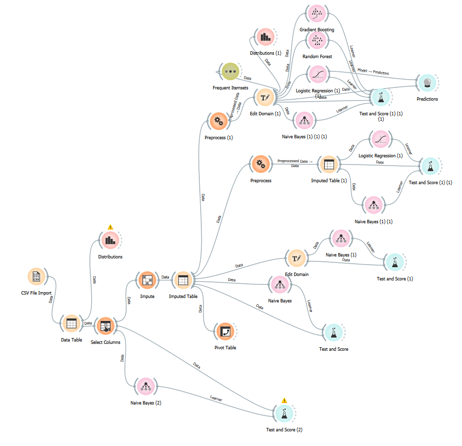
        <figcaption>Figura 13: Fluxo de widgets do Orange.</figcaption>
    </figure>

